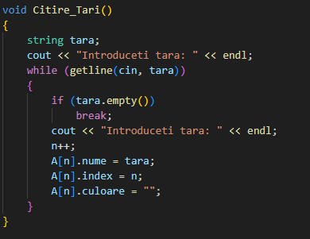
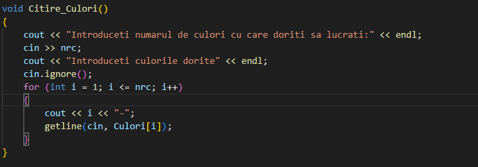
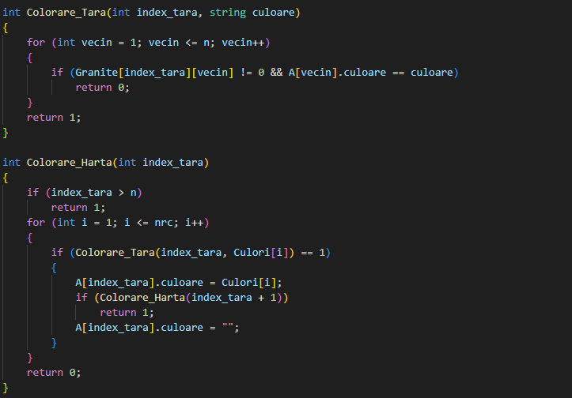
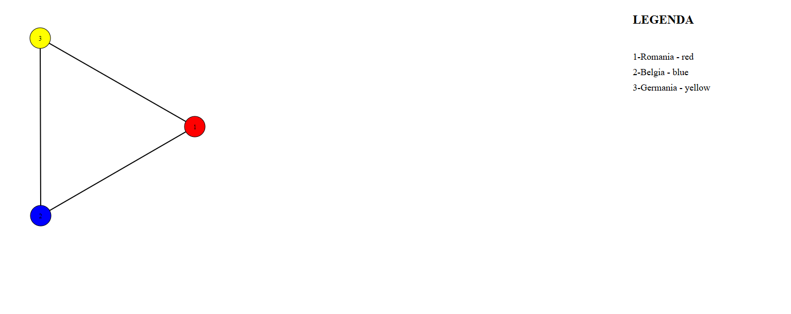

# Proiect_Map

## Cerința Proiectului
    Cerinta Proiectului: Un grup de N țări trebuie reprezentate pe o hartă cu culori diferite, astfel încât
oricare dintre acestea să fie colorată diferit de vecinii săi. Să se scrie un program
care primește la intrare lista celor N țări (denumire, listă vecini), lista de culori
posibile și determină culoarea pentru fiecare țără în parte.

## Descrierea problemei
Problema se rezumă la implementarea **Teoriei celor 4 culori**. Teoria spune că pentru a colora o hartă cu țări și granițe ai nevoie de maximum **4 culori**. Am folosit limbajul **C++** pentru a rezolva cerința proiectului.

## Implementare
### Structura de date utilizată
Am folosit o matrice de **N linii și N coloane** pentru a reprezenta țările și granițele (maximum 100 de țări). Această matrice este specifică grafurilor care stau la baza problemei.

Fiecare țără este reprezentată printr-o structură ce reține următoarele informații:
- **Nume**
- **Culoare**
- **Index**

### Funcții principale
1. **Citire_Tari()**
   - Permite introducerea unui număr arbitrar de țări, până la introducerea unei linii vide.
   

2. **Citire_Culori()**
   - Se utilizează pentru a seta numărul de culori disponibile și lista acestora, imediat după finalizarea citirii țărilor.
   

3. **Vecini()**
   - Oferă două meniuri interactive:
     1. **Selectare țără** pentru a adăuga vecini.
     2. **Afișare țări și vecini**.
     3. **Ieșire**.
   - După selectarea primei opțiuni:
     1. **Adăugare vecini**.
     2. **Ștergere vecini**.
     3. **Afișare vecini**.

4. **Colorare_Harta()**
   - Funcție recursivă care atribuie fiecărei țări o culoare din lista disponibilă.
   - Verifică dacă două țări vecine au aceeași culoare și încearcă o culoare diferită, dacă este posibil.
   - Returnează **0** dacă numărul de culori este insuficient pentru a colora harta conform cerințelor.
   - În caz de succes, permite generarea rezultatului final al colorării.

5. **hartaSVG()**
   - Generează un fișier SVG cu reprezentarea grafică a hărții colorate.

### Algoritmul de colorare
Pentru colorare, am utilizat un algoritm numit **Greedy Coloring**, implementat în C++ și adaptat cerințelor proiectului. 

#### Funcții pentru colorare
1. **Colorare_Tara()**
   - Primește ca argument o țără **X** și o culoare **Y**.
   - Verifică dacă vecinii țării **X** au setată culoarea **Y**.
     - Returnează **1** dacă vecinii NU au setată culoarea **Y**.
     - Returnează **0** dacă vecinii au deja culoarea **Y**.

2. **Colorare_Harta()**
   - Funcție recursivă ce atribuie fiecărei țări o culoare disponibilă din listă.
   - Returnează **0** dacă numărul de culori este insuficient pentru a colora harta.

3. **Rezultat_Colorare()**
   - Verifică dacă procesul de colorare a avut succes.
   - În caz afirmativ, afișează un mesaj corespunzător, urmat de:
     - Indexul, numele și culoarea fiecărei țări din hartă.
   - În caz negativ, afișează mesajul **"Nu s-a reușit colorarea hărții."**, iar programul va trebui reluat de la 0.
   
   

### Generare hartă grafică
Pentru afișarea grafului, am folosit un fișier de tip **SVG** și o funcție **hartaSVG()**, care creează o hartă în care:
- Fiecare țără este ilustrată sub forma unui **cerc colorat și numerotat** (cu indexul și culoarea respectivă).
- Țările sunt aranjate într-o **formă circulară**.
- Granițele sunt reprezentate prin linii care unesc cercurile.
- Este prezentă o **legendă** pentru identificarea fiecărei țări și culorii sale.

#### Exemplu de utilizare
Input:
- **3 țări** introduse: *România, Belgia, Germania*.
- **3 culori** introduse: *roșu, verde, albastru*.

Output:
- Hartă SVG cu cele 3 țări colorate corespunzător, respectând cerințele.